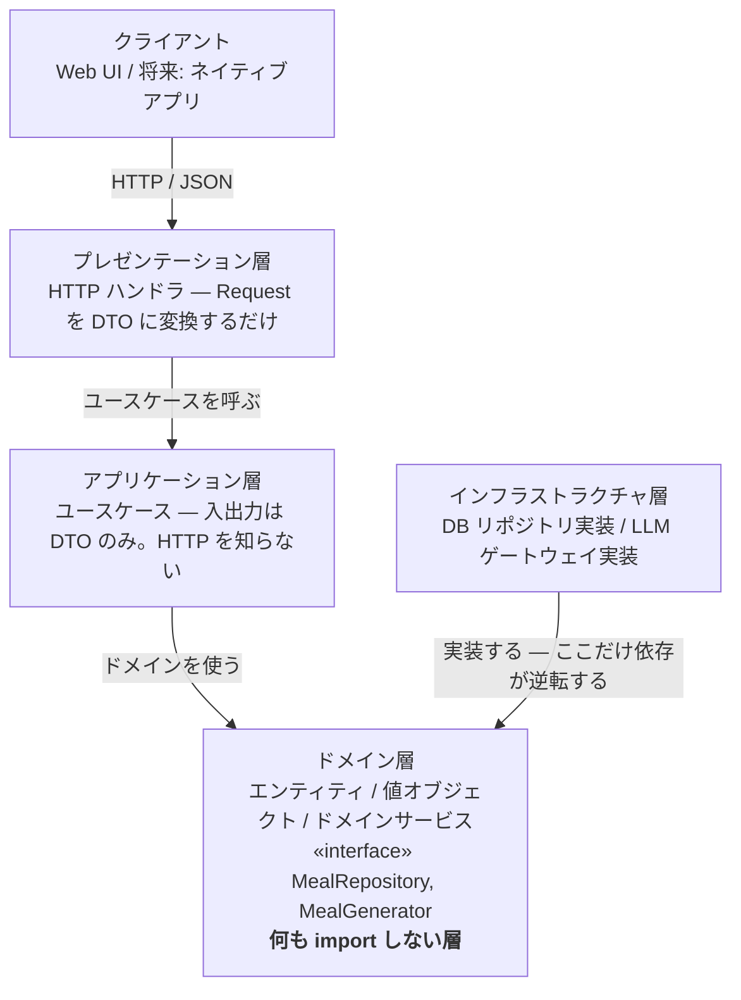

# アーキテクチャ決定録（ADR）

> ドラフト v0.2 / 2026-09-06 / ADR-001 〜 ADR-021
> **この文書がアーキテクチャ決定の正である。** 閲覧用の HTML 版は `html/adr.html`。

決定を変更する場合は、既存の ADR を書き換えず、**新しい ADR を起こして旧 ADR の状態を「置き換え済み」に改める**。

---

## A. 依存ルール

個別の ADR より先に、全体を貫く1つの規則を置く。

> **依存は必ず外から内へ向かう。例外は起動時の組み立て（composition root）だけ。**



### 層どうしの依存

| 依存する側 ↓ / される側 → | ドメイン | アプリケーション | インフラ | プレゼンテーション |
| --- | --- | --- | --- | --- |
| ドメイン層 | — | 禁止 | 禁止 | 禁止 |
| アプリケーション層 | 許可 | — | 禁止 | 禁止 |
| インフラ層 | 許可 | 禁止 | — | 禁止 |
| プレゼンテーション層 | **禁止** | 許可 | 禁止 | — |
| 起動時の組み立て | 許可 | 許可 | 許可 | 許可 |

**プレゼンテーション層 → ドメイン層が「禁止」である点に注意。** 外側が内側に依存すること自体はオニオンの原則に反しないが、ここを許すとドメインオブジェクトが画面まで漏れ出し、UI の都合でドメインが変形する。プレゼンテーション層が触れてよいのはアプリケーション層の DTO だけとする。

**「起動時の組み立て」**は全層を知る唯一の場所（composition root）。`apps/api/src/main.ts` の1ファイルに限定し、他所で `new DbMealRepository()` を書かない。

### 層の呼び名とディレクトリの対応

| 層の呼び名 | ディレクトリ | 置くもの |
| --- | --- | --- |
| プレゼンテーション層 | `contexts/*/api/` と `apps/web/` | HTTP ハンドラと UI。どちらも DTO しか触らない |
| アプリケーション層 | `contexts/*/usecase/` | ユースケース。入出力は DTO |
| ドメイン層 | `contexts/*/domain/` | エンティティ・値オブジェクト・ドメインサービスと、リポジトリ／ポートの interface |
| インフラストラクチャ層 | `contexts/*/infrastructure/` | リポジトリとポートの実装 |

層の呼び名とディレクトリ名は**1対1で対応する**。文書では層の名前で、コードではディレクトリ名で呼ぶ。**この表以外の対応を作らないこと。**

### やってはいけない依存

```
✕ ネイティブ化できなくなる形            ○ 正しい形
  execute(req: Request,                  execute(input: GenerateInput)
          res: Response)                   : GenerateOutput

  Web フレームワークの型が               変換の責務はハンドラが持つ。
  アプリケーション層に侵入する。          ユースケースは HTTP を知らないので、
  HTTP を持たない呼び出し元から使えない。 別クライアントからもそのまま呼べる。
```

ネイティブアプリ対応の可否は、この1点でほぼ決まる。**ユースケースの引数と戻り値にフレームワーク由来の型が1つでも現れた時点で、その層は Web に固定される。**

### コンテキストをまたぐ依存

ディレクトリはコンテキストで垂直に切る（ADR-013）。層のルールは**各コンテキストの内側で**成立し、そのうえでコンテキスト間にもう一段の規則が要る。

| import 元 | import してよい先 |
| --- | --- |
| `contexts/A/domain/` | `shared/domain/` のみ。**他コンテキストは一切不可** |
| `contexts/A/usecase/` | `contexts/A/domain/` と `contexts/B/usecase/`（公開されたユースケースのみ） |
| `contexts/A/infrastructure/` | `contexts/A/domain/` のみ |
| `contexts/A/api/` | `contexts/A/usecase/` のみ |
| `main.ts` | すべて（composition root） |

コンテキストをまたいでよいのは `usecase/` どうしだけ。相手の `domain/` を直接 import した瞬間、2つのコンテキストは1つに融合し、将来の切り出しが不可能になる。

**この規則は lint で強制することを推奨する。** 垂直分割の弱点は、層の違反が「隣のディレクトリ」で起きるため目視で気づきにくいことにある。ESLint の import 制限や dependency-cruiser で、上の表をそのまま設定に落とす。

### ディレクトリ構成

```
リポジトリルート
├─ apps/web/                  React + Vite（PWA）— API のクライアント
│  ├─ src/features/meal/       画面もコンテキスト単位で切る
│  ├─ src/features/pantry/
│  ├─ src/apiClient/
│  ├─ public/manifest.webmanifest
│  └─ vite.config.ts           vite-plugin-pwa
│
├─ apps/api/                  Hono on Cloudflare Workers
│  └─ src/
│     ├─ contexts/meal/       ← コアドメイン
│     │  ├─ domain/
│     │  │  ├─ entity/       Meal.ts  Suggestion.ts
│     │  │  ├─ value/        MealId.ts  MealIngredient.ts  CookingStep.ts
│     │  │  │                CookingRecord.ts  PantrySnapshot.ts
│     │  │  ├─ service/      MealCoverageService.ts  CookableMealFinder.ts
│     │  │  ├─ repository/   MealRepository.ts  SuggestionRepository.ts   «interface»
│     │  │  └─ port/         MealGenerator.ts                             «interface»
│     │  ├─ usecase/         SuggestMeals.ts  RegenerateMeals.ts
│     │  │                   ListMeals.ts  RecordCooking.ts
│     │  ├─ infrastructure/  DbMealRepository.ts  LlmMealGenerator.ts
│     │  │                   MealResponseParser.ts   ← 腐敗防止層
│     │  └─ api/             routes.ts
│     │
│     ├─ contexts/pantry/     同じ5つのディレクトリを持つ
│     ├─ contexts/catalog/    同じ
│     ├─ contexts/identity/   同じ
│     │
│     ├─ shared/domain/       HouseholdId.ts  Clock.ts
│     └─ main.ts              composition root — 全層を知る唯一の場所
│
└─ packages/contract/         API の型定義。web と api で共有する
```

`repository/` と `port/` は interface だけを置く。**`domain/` は何も import しない。**

`usecase/` は `domain/` の**兄弟**であって、下ではない。依存の向きが `usecase/ → domain/` の一方向だからである。

---

## B. 決定一覧

| # | 決定 | 状態 |
| --- | --- | --- |
| ADR-001 | オニオンアーキテクチャを採用する | 承認 |
| ADR-002 | リポジトリとポートのインターフェースをドメイン層に置く | 承認 |
| ADR-003 | ユースケースを HTTP API として公開し、UI をその一クライアントに限定する | 承認 |
| ADR-004 | モジュラーモノリスとして実装する | 承認 |
| ADR-005 | LLM を腐敗防止層の背後に隔離する | 承認 |
| ADR-006 | 献立を永続化し、再生成を明示操作に限定する | 承認 |
| ADR-007 | 在庫品を集約ルートとし、同一食材を統合しない | 承認 |
| ADR-008 | 集約をまたぐ参照は識別子で行う | 承認 |
| ADR-009 | 材料の充足判定を永続化せず都度算出する | 承認 |
| ADR-010 | 分量を構造化せず自由文字列として扱う | 承認 |
| ADR-011 | MVP ではドメインイベントを導入しない | 承認 |
| ADR-012 | 技術スタックの選定 | 置き換え済み |
| ADR-013 | コンテキストごとに垂直にディレクトリを切る | 承認 |
| ADR-014 | React + Vite の SPA とし、Next.js を採用しない | 承認 |
| ADR-015 | サーバサイドを Hono + Cloudflare Workers とする | 承認 |
| ADR-016 | PWA 化する。オフライン対応はアプリシェルに限る | 承認 |
| ADR-017 | 既存の献立の再利用を優先し、LLM 呼び出しを最後の手段とする | 承認 |
| ADR-018 | ユビキタス言語の中核を「献立 / Meal」とする | 承認 |
| ADR-019 | LLM プロバイダを未定のまま進める | **意図的に未決** |
| ADR-020 | データベースと認証を Supabase とする | 承認 |
| ADR-021 | 生成の重複回避はプロンプトで行い、保証はしない | 承認 |

---

## C. 決定の記録

### ADR-001　オニオンアーキテクチャを採用する　`承認`

- **状況** — 個人開発の小規模アプリだが、将来のネイティブアプリ対応と、献立生成方式の差し替え（LLM から自前 DB へ）が想定されている。一方で Clean Architecture の全レイヤー分割は、この規模には過剰。
- **決定** — ドメイン / アプリケーション / インフラストラクチャ / プレゼンテーションの4層とし、依存は外から内への一方向に限る。Entities と Use Cases をさらに細分する Clean Architecture 相当の分割は行わない。
- **理由** — 差し替えたいもの（DB・LLM・UI）がすべて外側にあり、守りたいもの（献立と在庫のルール）が中心にある。この形は本アプリの変更予測と一致する。
- **結果** — 層をまたぐたびに型の変換が要り、小さな機能追加でも複数ファイルに触れる。この冗長さは意図的なコストとして受け入れる。層の数をこれ以上増やさないことで上限を設ける。

### ADR-002　リポジトリとポートのインターフェースをドメイン層に置く　`承認`

- **状況** — ドメイン層はデータの永続化と献立の生成を必要とするが、その手段（DB、LLM API）は外側の関心事である。
- **決定** — `MealRepository` `StockItemRepository` `MealGenerator` をドメイン層に**インターフェースとして**定義し、インフラ層がこれを実装する。実装の注入は composition root で行う。
- **理由** — 依存関係逆転の実体。インターフェースを所有するのが呼ぶ側（ドメイン）であることにより、ドメイン層のソースコードに DB や HTTP クライアントの import が1行も現れなくなる。
- **結果** — ドメイン層のテストが実 DB・実 API なしで書ける。反面、インターフェースの設計を誤ると全実装に波及するため、メソッドは**ドメインの語彙で命名する**（`findByHousehold` であって `selectWhere` ではない）。

### ADR-003　ユースケースを HTTP API として公開し、UI をその一クライアントに限定する　`承認`

- **状況** — 将来 Web に加えてネイティブアプリを提供する可能性がある。フルスタックフレームワークを使う場合、UI とサーバ処理を密結合させる仕組み（サーバアクション等）が用意されており、素直に使うとアプリケーション層が Web に固定される。
- **決定** — すべてのユースケースを HTTP API として公開する。Web UI はその API のクライアントであり、特権的な近道を持たない。ユースケースの引数と戻り値には、フレームワーク由来の型（Request / Response / Cookie 等）を**一切含めない**。
- **理由** — ネイティブ化のコストは、この境界を最初に引くかどうかでほぼ決まる。後から剥がすのは、UI からサーバ処理を直接呼ぶコードが増えた分だけ困難になる。
- **結果** — Web だけを作る間は、API 経由の一往復が明確なオーバーヘッドになる。**これは将来のための前払いであり、ネイティブアプリを作らないと決めた時点で見直してよい。**

### ADR-004　モジュラーモノリスとして実装する　`承認`

- **状況** — 境界づけられたコンテキストが4つあるが、利用者は当面ひとりで、運用体制も個人である。
- **決定** — 4コンテキストを単一のデプロイ単位に収め、境界はディレクトリとモジュールの境界として表現する。コンテキスト間の呼び出しは関数呼び出しで行い、ネットワークを介さない。
- **理由** — サービス分割の運用コストに見合う規模ではない。境界を型とディレクトリで守れていれば、必要になった時点で切り出せる。
- **結果** — 境界の侵犯がコンパイルエラーにならないため、規律で守る必要がある。**コンテキストをまたぐ import は、相手コンテキストが公開したユースケース経由に限る**ことをルールとし、内部のエンティティを直接 import しない。

### ADR-005　LLM を腐敗防止層の背後に隔離する　`承認`

- **状況** — 献立の生成を LLM に委ねる。LLM の応答は形式が揺れうるうえ、将来は自前レシピ DB への差し替えも想定される。
- **決定** — ドメイン層のポート `MealGenerator` をインフラ層の `LlmMealGenerator` が実装する。応答の解析と検証は `MealResponseParser` が担い、**検証を通らない応答はドメイン層に渡さない**。プロンプト文字列・JSON・モデル名がドメイン層に現れてはならない。
- **理由** — 外部システムの都合をドメインモデルに侵入させないため。生成方式を差し替えるとき、書き換えるのはこのクラス1つで済む。
- **結果** — 変換層のぶん記述が増える。また、応答が検証を通らなかった場合の扱いを ACL 内で決める必要がある。**現時点では「ユーザーに再試行を促す」とし、自動リトライは行わない。**

### ADR-006　献立を永続化し、再生成を明示操作に限定する　`承認`

- **状況** — LLM は同じ在庫でも毎回異なる献立を返す。利用者は多様性を歓迎しているが、画面を戻るたびに候補が入れ替わるのは不具合に見える。加えて生成のたびに費用が発生する。
- **決定** — 生成した献立をすべて永続化する。画面を開いたときは保存済みの最新の提案を表示し、生成 API を呼ばない。新しい候補は「他の候補を見る」等の明示操作でのみ生成する。在庫が変わらない限り再生成しない（確定事項 C-7）。
- **理由** — 体験の安定と費用の抑制が同じ手段で両立する。さらに、蓄積した献立は「以前見た献立」「つくった献立」という機能そのものになり、将来の自前レシピ DB の初期データにもなる。
- **結果** — 献立が単調増加する。保持期間の方針が必要になる（未決 Q-2）。また「表示は速く、生成は待たせてよい」という性能要件の分離が前提になる。

### ADR-007　在庫品を集約ルートとし、同一食材を統合しない　`承認`

- **状況** — 「冷蔵庫」を集約ルートにして在庫品を配下に置くか、在庫品自体を集約ルートにするかの選択がある。
- **決定** — 在庫品（`StockItem`）を集約ルートとする。同じ食材を別の日に買った場合も統合せず、独立した在庫品として扱う。
- **理由** — 買った日が違えば期限が違う。統合すると期限をどちらに寄せるか決められず、期限管理が壊れる。統合しないほうが現実に即しており、集約も小さくなる。
- **結果** — 一覧に「にんじん」が2行並びうる。**これは仕様であり、まとめる要件は持たない。**

### ADR-008　集約をまたぐ参照は識別子で行う　`承認`

- **状況** — `Suggestion` は3件の `Meal` を参照する。オブジェクト参照を持たせると、読み込み範囲が際限なく広がる。
- **決定** — 集約をまたぐ参照はすべて識別子（`MealId` 等）で保持する。オブジェクト参照を持たない。1トランザクションで更新してよい集約は1つまでとする。
- **理由** — 集約の境界が実際の一貫性の境界と一致し、読み込みと更新の範囲が予測可能になる。
- **結果** — 画面表示のためにリポジトリを複数回呼ぶ場面が出る。**その解決に集約を結合させてはならず、必要ならアプリケーション層に読み取り専用の問い合わせを追加する。**

### ADR-009　材料の充足判定を永続化せず都度算出する　`承認`

- **状況** — 「この献立は在庫で作れるか」は献立と在庫の両方に依存する。在庫は献立の生成後も変化し続ける。
- **決定** — 充足の結果を献立に保存せず、表示のたびに `MealCoverageService` が現在の在庫と突き合わせて算出する。
- **理由** — 保存すると在庫の変化のたびに全献立を更新する必要が生じ、更新漏れが必ず起きる。導出可能な値は導出する。
- **結果** — 一覧表示のたびに計算が走る。**「以前つくった献立」の一覧では充足を算出しない**ことで負荷を抑える。

### ADR-010　分量を構造化せず自由文字列として扱う　`承認`

- **状況** — 「200g」「1本」「少々」を数値と単位に分解するか、文字列のまま扱うかの選択がある。
- **決定** — `Amount` を自由文字列の値オブジェクトとする。数値と単位に分解しない。
- **理由** — 分量を使うのは LLM への入力と画面表示だけで、**数量の演算をする要件が存在しない**。構造化すると入力欄が増え、登録の手間という最大の離脱要因を悪化させる。
- **結果** — 「在庫の 200g に対して献立が 300g 必要」といった不足量の判定ができない。充足判定は食材名の有無のみで行う（確定事項 C-6）。

### ADR-011　MVP ではドメインイベントを導入しない　`承認`

- **状況** — 「献立が調理された」「在庫が登録された」はドメインイベントとして表現できるが、現時点でそれに反応する処理が存在しない。
- **決定** — ドメインイベントの仕組みを導入しない。コンテキスト間の連携はユースケースからの直接呼び出しで行う。
- **理由** — 購読者のいないイベント機構は、処理の流れを追いにくくするだけの複雑さになる。**非同期処理を要する要件が現れてから導入する。**
- **結果** — 通知機能などを追加する際に、この決定の見直しが必要になる。その時点で新しい ADR を起こす。

### ADR-012　技術スタックの選定　`置き換え済み`

- **状況** — Nuxt / Vue と Next.js / React のいずれかを選ぶ論点として起票した。
- **結果** — **ADR-014（フロントエンド）と ADR-015（サーバサイド）に置き換えられた。** いずれの選択肢も採らず、React + Vite と Hono + Cloudflare Workers の組み合わせに決定した。

### ADR-013　コンテキストごとに垂直にディレクトリを切る　`承認`

- **状況** — 当初は層でトップレベルを切っていた（`domain/` `application/` …）。この形では、献立に1つ機能を足すたびに4つの離れたディレクトリを行き来することになり、**コンテキストの境界がディレクトリ上に一切現れない**。
- **決定** — トップレベルを境界づけられたコンテキストで切り、層はその内側に置く。各コンテキストは `domain/` `usecase/` `infrastructure/` `api/` の4つを持ち、`domain/` の中をさらに `entity/` `value/` `service/` `repository/` `port/` に分ける。
- **理由** — 変更が届く単位はコンテキストであって層ではない。境界がディレクトリとして目に見えるため、ADR-004 のモジュラーモノリスの規律が守りやすく、切り出しが必要になったときもディレクトリごと移せる。**ユースケースとエンティティを別ディレクトリに保つことで、層の区別は垂直分割後も失われない。**
- **結果** — 層の違反が「隣のディレクトリ」で起きるため目視で気づきにくくなる。**依存ルールは lint で機械的に強制することを推奨する。**

### ADR-014　React + Vite の SPA とし、Next.js を採用しない　`承認`

- **状況** — React を選ぶとして、Next.js を使うかどうか。本アプリはログイン必須で、扱うのは個人の在庫データである。
- **決定** — React + Vite の SPA とする。Next.js は採用しない。
- **理由** — 3つある。**(1)** ログイン後のプライベートな画面しかなく、SEO も SSR も価値を生まない。**(2)** Next.js の最大の利点であるサーバ統合（サーバアクション等）は、UI からサーバ処理を直接呼べる仕組みであり、**ADR-003 が避けようとしている依存そのもの**である。使わないなら採用する理由が薄く、使えば決定に反する。**(3)** SPA は構造上「API のクライアント」でしかないため、ADR-003 の境界が意識せずとも守られる。
- **結果** — 初回読み込みは SSR より遅い。ログイン後に使うアプリなので許容し、PWA のキャッシュ（ADR-016）で2回目以降を速くする。公開ページや SEO が必要になった時点で見直す。

### ADR-015　サーバサイドを Hono + Cloudflare Workers とする　`承認`

- **状況** — LLM の API キーをクライアントに置けないため、サーバが必須。SPA を選んだ結果、サーバは API 専任になり、**ドメイン層とユースケース層はここに置かれる**。
- **決定** — Hono を Cloudflare Workers 上で動かす。`apps/api/` がドメイン層・ユースケース層・インフラ層を含み、`apps/web/` はその HTTP クライアントに徹する。
- **理由** — 無料枠が広く「ランニングコストをなるべく安く」という要求に合う。Web 標準 API ベースでフレームワークへのロックインが軽い。TypeScript なので、ドメイン層をフロントと同じ言語で書け、`packages/contract/` で API の型を共有できる。
- **結果** — Workers には実行時間と CPU の制限がある。**LLM の呼び出しは数十秒かかりうるため、制限に収まるかを実装初期に確認する必要がある。** 収まらない場合はストリーミング応答か、生成を非同期化して結果をポーリングする形に変える。

### ADR-016　PWA 化する。オフライン対応はアプリシェルに限る　`承認`

- **状況** — 台所で使うため、ホーム画面から即起動できることに価値がある。一方、データのオフライン書き込みを許すと同期と競合解決が必要になり、MVP の規模を大きく超える。
- **決定** — マニフェストとサービスワーカーを備え、ホーム画面に追加できるようにする。キャッシュするのは**アプリの外枠（HTML・CSS・JS）だけ**とし、データのオフライン読み書きは行わない。オフライン時はその旨を表示して操作を止める。
- **理由** — PWA 化の目的は**設置と起動の速さ**であって、オフライン動作ではない。目的をここで区切ることで、同期の複雑さを丸ごと回避できる。
- **結果** — 2つの制約を受け入れる。**(1)** iOS の Safari は `beforeinstallprompt` を実装していないため、ワンタップのインストールバナーを出せない。利用者が自分で「共有 → ホーム画面に追加」をたどる必要があり、**案内 UI がなければ事実上インストールされない**。**(2)** iOS で Web プッシュ通知が届くのはホーム画面に追加された場合のみで、タブで開いているだけでは届かない。期限通知は Could のまま据え置く。

### ADR-017　既存の献立の再利用を優先し、LLM 呼び出しを最後の手段とする　`承認`

- **状況** — ADR-006 で在庫が変わらない限り再生成しないことは決めたが、**在庫が変われば必ず生成が走る**。一方その頃には、今日の在庫でそのまま作れる献立が手元に貯まっている。
- **決定** — 提案の組み立てを3段で試みる。**(1)** 在庫が前回と同じなら保存済みの提案を返す。**(2)** 違えば、既存の献立から現在の在庫で不足0件のものを選ぶ。**(3)** それで3件に満たない分だけを LLM に生成させる。「他の候補を見る」はこの経路に乗せず、常に新規生成する。
- **理由** — 費用と待ち時間の両方が同時に下がる。しかも**使い続けるほど手持ちが増えて再利用率が上がる**ため、1回あたりのコストは時間とともに下がっていく。ユーザーにとっても「前に見たあれが今日作れる」は有用な情報であり、機能の劣化ではない。
- **結果** — 3つの帰結を引き受ける。**(1)** 再利用の精度が充足判定に依存し、それは食材名の完全一致で行っている（C-6）。**ここが弱いと仕組み全体が働かないため、食材カタログの別名データが実質的な前提条件になる。** **(2)** 再利用は明示表示が必須。黙って混ぜると同じ献立が出たとしか見えない。**(3)** 同じ献立が出続けないよう、直近の提案に出したものを除外する規則が要る（C-11）。

### ADR-018　ユビキタス言語の中核を「献立 / Meal」とする　`承認`

- **状況** — 生成物の呼称が定まらないと全レイヤーの識別子が決まらない。当初の「献立案 / `MealIdea`」は文書としては正確だが、UI に置くと固い。
- **決定** — **献立 / `Meal`。**「レシピ」「メニュー」「候補」「料理」「献立案」はすべて予約語として使用を禁じる。
- **理由** — アプリの価値（献立が決まる）と語が一致し、UI が「前に見た献立」「作った献立」と自然に書ける。`Meal` と `Suggestion` は識別子として十分に区別でき、コンテキスト名「献立コンテキスト」とも衝突しない。
- **結果** — 「レシピ / `Recipe`」を空けておける。**ADR-006 の移行先である自前レシピ DB を将来持ったとき、`Recipe`（検証済みの既存レシピ）と `Meal`（この世帯のために生成された献立）を別概念として導入できる。**

### ADR-019　LLM プロバイダを未定のまま進める　`意図的に未決`

- **状況** — Claude・Gemini など複数の候補がある。一方、生成は `MealGenerator` ポートの背後に隔離済みで（ADR-005）、実装は1クラスに閉じている。
- **決定** — **いま決めない。** プロバイダは差し替え可能な詳細として扱い、他の設計と実装を先に進める。
- **理由** — 早く決めても得るものがない。むしろ**プロンプト設計を固めてから、同じプロンプトを複数のプロバイダに投げて比べたほうが、判断材料が揃う**。ポートと腐敗防止層があることの実際的な見返りが、まさにこの「決定を遅らせられる」ことである。
- **比較の軸** — 決定時に見るべき順に、**(1) 構造化出力（JSON）の安定性** — これが最重要。形式が揺れると腐敗防止層の検証失敗が増え、再試行が実質的な追加コストになる。**(2)** 日本語・家庭料理の質。**(3)** 単価。**(4)** レイテンシ（ADR-015 の Workers 実行時間制限に効く）。
- **結果** — 要件定義の費用試算は Claude の単価に基づく暫定値であり、決定時に置き換える。**この未決はプロジェクトを止めない。**

### ADR-020　データベースと認証を Supabase とする　`承認`

- **状況** — API は Cloudflare Workers 上に置く（ADR-015）。データベースと認証が必要。対抗案は Cloudflare D1 + 自前認証で、こちらはプラットフォームが1つで済む。
- **決定** — Supabase（Postgres + Auth）を使う。Workers からは **supabase-js（HTTP / PostgREST 経由）** で接続する。
- **理由** — **(1) 認証を自前で作らずに済む。** MVP の速度に直結する。**(2) 行レベルセキュリティ（RLS）が安全網になる。** 世帯によるデータ分離をアプリコードだけで守る形は、`householdId` の付け忘れ1箇所で破れる。同じ制約をデータベース側にも置けるのは、対抗案にはない価値である。**(3)** Postgres なので将来の検索・集計で詰まらない。
- **結果** — 4つの帰結を引き受ける。
  1. **RLS を効かせるには、Workers から `service_role` キーではなく利用者の JWT で問い合わせなければならない。** `service_role` は RLS を迂回するため、それを使うと採用理由 (2) が丸ごと消える。**実装上の必須事項。**
  2. Postgres への直接 TCP 接続はエッジ実行と相性が悪く、Hyperdrive のような接続プールを挟む必要がある。**supabase-js の HTTP 経由なら不要**なので当面それで進める。
  3. **無料プランのプロジェクトは、API リクエストが1週間ないと自動的に一時停止される。** データは保持されるが手動で再開するまで止まる。定期的にアクセスする仕組みを置くか、停止と再開を受け入れるかを決める必要がある。
  4. **プラットフォームが2つになる**（Cloudflare と Supabase）。1つにまとめたいなら API を Supabase Edge Functions に寄せる手はあるが、Deno 環境になり Hono を選んだ利点が薄れる。**当面は2つで進め、運用の煩雑さが実際に問題になった時点で見直す。**

### ADR-021　生成の重複回避はプロンプトで行い、保証はしない　`承認`

- **状況** — すでに手元にある献立と同じものが再び生成されると、履歴が同じ料理で埋まる。一方、意味的な重複（「豚肉と白菜の炒め物」と「豚こまと白菜の中華炒め」）をコードで判定するのは難しい。
- **決定** — 生成時のプロンプトに**既存の献立名の一覧を含め、それらとは異なるものを生成するよう指示する**。渡す件数には上限を設ける（初期値: 直近50件）。`MealGenerator` ポートは「在庫スナップショット・必要件数・避けるべき献立名」を受け取る。
- **理由** — 表記の違う同じ料理を見分けられるのは、コードではなく LLM 自身である。判定を自前で持たず、生成側に避けさせるのが最も素直で、実装も増えない。
- **結果** — **(1) これは best-effort であって保証ではない。** 重複が出ても壊れない設計は維持する。**(2) 上限は必ず設ける。** 件数に比例して入力トークンが増えるため、上限を外すと蓄積とともに費用が増え、ADR-017 の削減効果を打ち消しかねない。**(3)** それでも名称が完全一致した場合の扱いを定めた（確定事項 C-4）。
