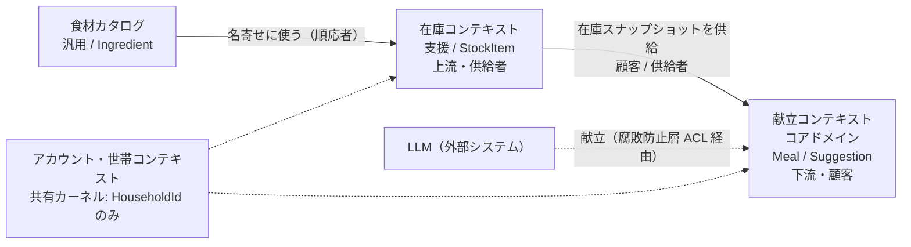
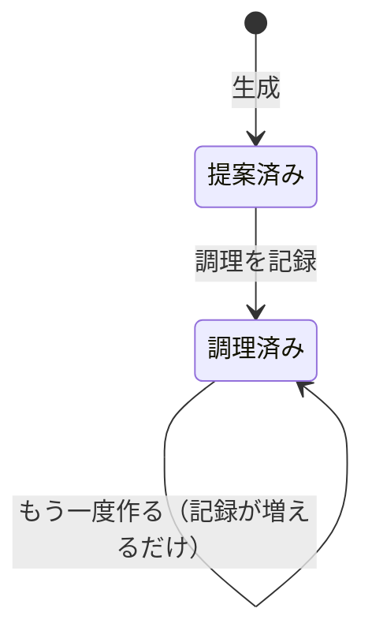
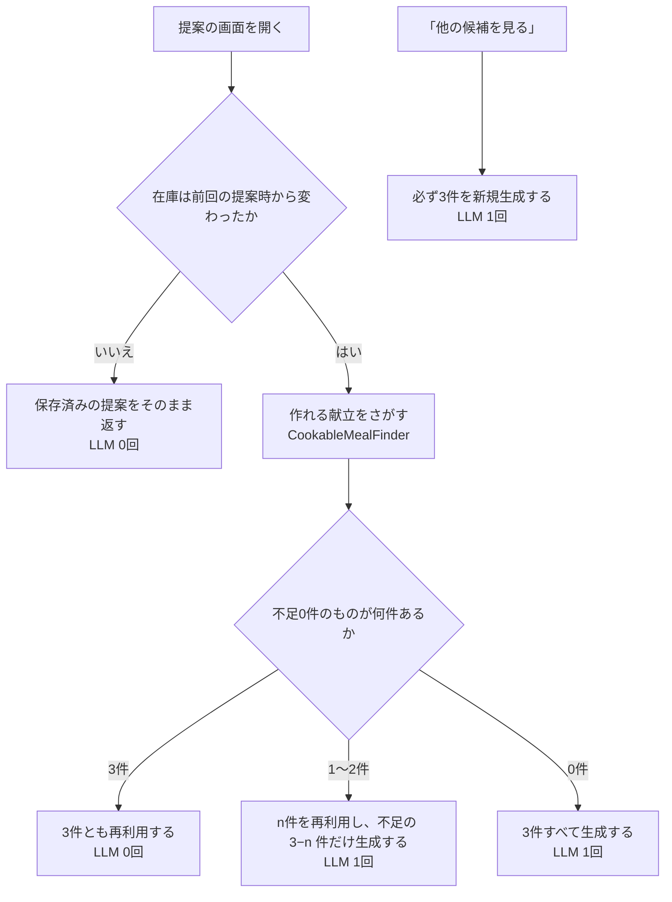

# ドメインモデル

> ドラフト v0.2 / 2026-09-06 / 要件定義書 v0.5 に対応
> **この文書がドメインの構造と用語の正である。** 閲覧用の HTML 版は `html/domain-model.html`。

冷蔵庫の在庫を起点に献立を提案するアプリケーションの、サブドメイン分類・境界づけられたコンテキスト・集約と不変条件。実装時の判断の余地をできるだけ潰すことを目的とする。

---

## 1. サブドメインの分類

どこに労力を注ぎ、どこを既製品で済ませるかの判断。**献立提案だけがコアドメイン**であり、在庫管理はその入力を供給する支援に過ぎない。在庫管理そのものを作り込むと、目的（献立を考える手間の解消）から逸れる。

| サブドメイン | 種別 | 内容 |
| --- | --- | --- |
| **献立提案** | **コアドメイン** | 在庫を制約として献立を生み、提示し、記憶する。差別化の源泉であり、設計とテストの投資先 |
| 在庫管理 | 支援 | コアへの入力を供給する。汎用品では代替できないが、それ自体は価値を生まない。素朴に作る |
| 食材カタログ | 汎用 | 食材名の正規化・別名・カテゴリ。既製のデータで代替可能。自作しない |
| アカウント・世帯 | 汎用 | 認証と世帯の識別。外部の認証基盤に委譲し、自前で持つのは世帯の識別子のみ |

## 2. 境界づけられたコンテキストとコンテキストマップ

4つのコンテキストに分ける。MVP では単一デプロイのモジュラーモノリスとして実装し、コンテキスト間はモジュール境界として表現する（ADR-004）。

在庫が上流、献立が下流。献立側の必要（期限の近い在庫を優先したい）が、在庫側の公開インターフェースを規定する。

### 腐敗防止層（ACL）が守るもの

LLM は形式の揺れた出力を返しうる。ACL は「LLM の応答 JSON」を「`Meal` のドメインオブジェクト」に変換し、変換に失敗したものは**ドメイン層に一切渡さない**。

> **ドメイン層のどこにも、LLM・プロンプト・JSON・モデル名という語が現れてはならない。**

## 3. ユビキタス言語

日本語の語と、コード上の識別子を1対1で固定する。**この表にない語をコードに登場させない。** 同義語の混在が、AI 実装で最も曖昧性を生む。

| 日本語 | 識別子 | 定義 | コンテキスト |
| --- | --- | --- | --- |
| **献立** | `Meal` | 生成された1つの献立。名称・材料・手順を持ち、永続化される。「以前見た献立」「つくった献立」として再表示される実体はこれ | 献立 |
| **提案** | `Suggestion` | 1回の生成でまとめて得られた献立の束（3件）と、そのときの在庫スナップショット | 献立 |
| **材料** | `MealIngredient` | 献立が必要とする食材と分量。献立の一部として複製され、以後は在庫の変化に影響されない | 献立 |
| **手順** | `CookingStep` | 調理の1ステップ。順序を持つ | 献立 |
| **調理記録** | `CookingRecord` | 献立を実際に作ったという記録。追加のみで、取り消さない | 献立 |
| **在庫スナップショット** | `PantrySnapshot` | 生成時点の在庫の複製。以後不変。同じ在庫での再生成を避ける判定に使う | 献立 |
| **充足** | `MealCoverage` | ある献立の材料が、現在の在庫でどれだけ賄えるか。永続化せず都度算出する | 献立 |
| **作れる献立** | `CookableMeal` | 手持ちの献立のうち、現在の在庫で**不足材料0件**のもの。LLM を呼ばずに提案へ回せる | 献立 |
| **再利用** | `reused` | 既存の献立をそのまま提案に含めること。新規生成と区別して表示する | 献立 |
| **在庫品** | `StockItem` | 冷蔵庫にある1件の食材。名称・数量・期限を持つ。集約ルート | 在庫 |
| **期限** | `ExpiryDate` | 使い切りたい日。賞味/消費期限は区別しない。未設定を許す | 在庫 |
| **分量** | `Amount` | 「200g」「1本」など。構造化せず自由文字列として扱う（ADR-010） | 在庫・献立 |
| **食材** | `Ingredient` | 「にんじん」等の種類を表すカタログ上の概念。在庫品とは別物 | 食材カタログ |
| **世帯** | `Household` | 冷蔵庫を共有する単位。MVP では常に1利用者1世帯。全データの所有者 | アカウント |
| **利用者** | `User` | 認証の主体 | アカウント |

### 使ってはいけない語

**レシピ / Recipe / メニュー / Menu / 候補 / 料理 / ストック / アイテム / フード / 献立案 / MealIdea**

いずれも上表の語と衝突する。コード・UI・仕様のどこにも使わない。とくに **`Recipe` は将来の自前レシピ DB（ADR-006 の移行先）のために予約済み**であり、生成物には用いない。

## 4. 集約と不変条件

集約ルートは4つ。**集約をまたぐ参照はすべて識別子で行い、オブジェクト参照を持たない**（ADR-008）。1トランザクションで更新してよいのは1集約まで。

### 献立 `Meal`（コア・集約ルート）

| 構成 | 不変条件 |
| --- | --- |
| `id: MealId` `householdId: HouseholdId` `title: string` `ingredients: MealIngredient[]` `steps: CookingStep[]` `provenance: 'llm'` `generatedAt: DateTime` `cookingRecords: CookingRecord[]` | `title` は空文字を許さない `ingredients` は1件以上 `steps` は1件以上、順序を持つ ちょうど1つの世帯に属し、所属は変わらない `cookingRecords` は**追加のみ**。削除・更新しない 生成後、`title` / `ingredients` / `steps` は不変 |

### 提案 `Suggestion`（コア・集約ルート）

| 構成 | 不変条件 |
| --- | --- |
| `id: SuggestionId` `householdId: HouseholdId` `entries: SuggestionEntry[]` 　各要素は `{ mealId, origin }` 　`origin: 'generated' \| 'reused'` `pantrySnapshot: PantrySnapshot` `generatedAt: DateTime` | `entries` はちょうど3件 参照する献立は同じ世帯に属する 同じ `mealId` を2つ以上含まない 生成後は完全に不変（追記も削除もしない） `pantrySnapshot` は生成時点の複製であり、以後の在庫変更を反映しない |

### 在庫品 `StockItem`（集約ルート）

| 構成 | 不変条件 |
| --- | --- |
| `id: StockItemId` `householdId: HouseholdId` `name: string`（自由入力を許す） `ingredientId: IngredientId \| null` `amount: Amount \| null` `expiryDate: ExpiryDate \| null` | `name` は空文字を許さない 同じ食材でも**統合しない**。買った日が違えば別の在庫品（ADR-007） `expiryDate` が未設定の在庫品は、期限による警告・優先の対象外 削除は物理削除でよい。献立は材料を複製済みで参照を持たない |

### 食材 `Ingredient`（カタログ・集約ルート）

| 構成 | 不変条件 |
| --- | --- |
| `id: IngredientId` `canonicalName: string` `aliases: string[]` `category: IngredientCategory` | 読み取り専用。アプリケーションから更新しない `canonicalName` は全体で一意 |

### ドメインサービスとポート

| 種別 | 名前 | 責務 |
| --- | --- | --- |
| ドメインサービス | `MealCoverageService` | 献立と現在の在庫品リストを受け取り、賄える材料と不足する材料を返す。純粋関数であり、副作用も永続化も持たない |
| ドメインサービス | `CookableMealFinder` | 手持ちの献立と現在の在庫から、今すぐ作れる献立を選び出す。LLM 呼び出しを回避する判断の中心（第6章）。純粋関数 |
| ポート（interface） | `MealGenerator` | 在庫スナップショット・必要件数・**避けるべき献立名**を受け取り、献立を返す。**ドメイン層に定義し、インフラ層が LLM で実装する**。依存の向きが逆転する要（ADR-002） |

## 5. 献立の状態 —「見た」と「つくった」

「以前見た献立」と「以前つくった献立」を**別のフラグとして持たない**。調理記録の有無から導出する。状態を二重に持つと必ず食い違うため、単一の事実（調理記録）だけを保存する。

| 状態 | 条件 | UI での呼び方 |
| --- | --- | --- |
| 提案済み | `cookingRecords.length === 0` | 「以前見た献立」 |
| 調理済み | `cookingRecords.length >= 1` | 「つくった献立」 |

状態は戻らない。調理記録は取り消せない。

「見た」は生成と同時に成立する — 生成した3件は必ずすべて提示するため、提示済みフラグは不要（確定事項 C-2）。したがって永続化される事実は調理記録だけであり、2つの一覧はどちらもその有無による絞り込みで実装できる。

## 6. 提案の組み立て — LLM を呼ばずに済ませる

提案は必ずしも生成ではない。**手持ちの献立で今日作れるものがあれば、それを先に使う。** LLM は不足分を埋める最後の手段として置く。これは費用の話であると同時に、応答速度の話でもある — 再利用だけで組めた提案は待ち時間なしで表示できる。

手持ちの献立は使うほど増えるので、**使い続けるほど左上の経路に入る確率が上がり、1回あたりの費用と待ち時間が下がっていく**。ただし「他の候補を見る」は例外で、ここは新しさを求めた明示操作なので必ず生成する。

### 再利用は隠さない

再利用した献立は `SuggestionEntry.origin` が `'reused'` となり、UI 上も新規生成と区別して示す。黙って混ぜると「なぜ同じ献立がまた出るのか」としか映らない。**「前に見たこれ、今日の在庫で作れます」という提示にして初めて価値になる。**

### 生成する分にも既存の献立名を渡す

不足分を LLM に生成させるとき、**すでに手元にある献立の名前を渡して「これらとは違うものを」と指示する**（ADR-021）。再利用と新規生成が同じ料理を指してしまうと、3件並べた意味がなくなる。渡す件数には上限を設ける — 蓄積に比例して入力トークンが増え、せっかくの削減効果を打ち消すため。

### ⚠ 再利用の判定は充足と同じ弱点を持つ

`CookableMealFinder` は `MealCoverageService` の結果に依存するため、確定事項 C-6（名称の完全一致）の制約をそのまま引き継ぐ。表記ゆれで一致しなければ「作れない」と判定され、再利用の機会を逃す。**再利用率が上がらない場合、まず疑うのは食材カタログの別名データである。**

## 7. 確定事項 — 実装時に迷わないための決定

実装時に判断を求められそうな箇所を、あらかじめ潰しておく。**ここに書かれていることは実装者（AI を含む）が勝手に変えてよいものではない。** 破る必要が出たら、コードを書く前に相談すること。

| # | 決定 |
| --- | --- |
| **C-1** | **生成した献立は必ず永続化する。** LLM の応答を画面に出すだけで捨ててはならない。ACL で `Meal` に変換した時点で保存する。保存に失敗した献立は、ユーザーに提示しない |
| **C-2** | **生成した3件はすべて提示する。** 生成件数と提示件数は常に等しい。「生成したが見せていない献立」は存在しない。これにより提示済みフラグが不要になる |
| **C-3** | **献立は生成後に編集できない。** 名称・材料・手順は不変。ユーザーが手を加えたい場合の要件は MVP に存在しない。追加されるのは調理記録のみ |
| **C-4** | **重複は生成時にプロンプトで避け、名称の完全一致のみ既存を参照する。** 既存の献立名をプロンプトに渡して重複を避けさせる（ADR-021）。それでも名称が完全一致した生成結果は、新規保存せず既存の献立を参照し、その要素の `origin` は `'reused'` とする。**意味的な重複（表記の違う同じ料理）は引き続き検出しない** |
| **C-4b** | ⚠ **C-11 の除外を、生成結果の一致がすり抜けうる。** C-11 で再利用対象から外した献立と同じ名称を LLM が生成した場合、C-4 により既存が参照され、除外したはずのものが提案に戻る。**これは既知の穴であり、稀なので許容する。** 塞ぐには生成結果を破棄して再試行することになるが、費用と待ち時間に見合わない |
| **C-5** | **材料は在庫品を参照せず、文字列として複製する。** `MealIngredient` は `StockItemId` を持たない。在庫品が削除されても献立は壊れない。充足判定は名称の突き合わせで都度行う |
| **C-6** | ⚠ **充足判定は名称の完全一致で行う（MVP）。** 「豚こま肉」と「豚こま」は一致しないものとして扱う。表記ゆれの吸収は食材カタログの別名機能に委ね、それでも漏れるものは不足材料として表示する。**これは既知の割り切りであり、精度の問題が出たときに見直す** |
| **C-7** | **再生成の判定は在庫スナップショットの一致で行う。** 最新の `Suggestion.pantrySnapshot` が現在の在庫と一致する場合、生成 API を呼ばず保存済みの献立を返す。一致判定は在庫品の `(name, amount, expiryDate)` の集合比較とする。`id` は比較に含めない |
| **C-8** | **調理記録は在庫を自動で減らさない。** 「作った」を記録しても在庫品は自動削除されない。何をどれだけ使ったかを正しく推定できないため。在庫の消費はユーザーが在庫画面で明示的に行う |
| **C-9** | **世帯 ID はすべての集約が保持する。** 4つの集約ルートすべてが `householdId` を持ち、リポジトリの全メソッドは `householdId` を必須引数に取る。世帯をまたぐ取得を、型として不可能にする |
| **C-10** | **再利用の対象は不足材料0件の献立に限る。** 1件でも足りない献立を再利用するくらいなら、新規生成のほうが良い提案になる。「ほぼ作れる」は再利用しない |
| **C-11** | **直近3回の提案に含めた献立は再利用対象から除外する。** これがないと、在庫が安定している期間ずっと同じ3件が出続ける。除外は `Suggestion` の履歴から判定し、フラグを持たない |
| **C-12** | **再利用の優先順位は「期限の近い在庫をより多く使うもの」。** 同点の場合は調理記録があるものを優先する。さらに同点なら生成日時の新しい順。**順序は決定的でなければならない** — 同じ入力で並びが変わってはいけない |
| **C-13** | **1つの提案に同じ献立を2つ以上含めない。** 再利用の候補選出では重複を明示的に排除する |
| **C-14** | **再利用のみで組めた提案も `Suggestion` として保存する。** 生成していなくても提案は保存する。C-11 の除外判定と C-7 の在庫スナップショット比較が、どちらもこの記録に依存する |

## 8. 未決の論点

**ここを勝手に決めて実装を進めないこと。**

| # | 論点 | 影響 |
| --- | --- | --- |
| Q-1 | ~~ユビキタス言語の中核の呼称~~ | **決定済み。「献立 / `Meal`」とする（ADR-018）** |
| Q-2 | 献立の保持期間。無制限に貯めるか、一定期間で削除するか | ストレージ費用。ただし再利用（第6章）は蓄積が多いほど効くため、消すと費用対効果が悪化する。安易に消さない方針が有力 |
| Q-3 | 提案が3件固定でよいか。在庫が少なく生成しても3件に満たない場合の扱い | `Suggestion` の不変条件。現状は「ちょうど3件」としている |
| Q-4 | 食材カタログの初期データの出所と件数 | C-6 の充足判定、ひいては**再利用率に直結する**。ここが弱いと第6章の仕組みが働かない |
| Q-5 | C-11 の除外期間「直近3回」が妥当か | 短すぎると同じ献立が続き、長すぎると再利用の機会を失う。実際に使ってから調整する |
| Q-6 | ADR-021 でプロンプトに渡す既存献立名の上限「50件」が妥当か | 少なすぎると重複が増え、多すぎると入力トークンが増える。プロンプト設計の試行で調整する |
